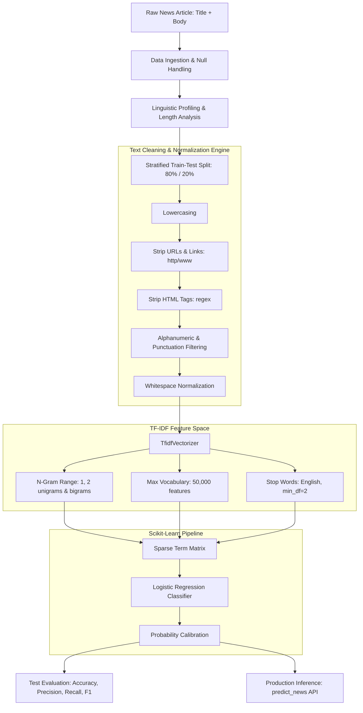

<div align="center">

# 📰 Fake News Detection with NLP & Machine Learning

<p align="center">
  <strong>An end-to-end Natural Language Processing (NLP) text classification pipeline designed to detect misinformation, fabricated articles, and clickbait with high precision using the WELFake benchmark dataset.</strong>
</p>

[](https://www.python.org/)
[](https://scikit-learn.org/)
[](https://pandas.pydata.org/)
[](https://numpy.org/)
[](https://jupyter.org/)
[](#-model-evaluation--performance)
[](#-model-evaluation--performance)

[📓 Open Notebook](fake_news.ipynb) • [📊 Dataset](WELFake_Dataset.csv) • [🚀 Try Inference](#-predictive-system--inference) • [Report Issue](https://github.com/devloopcode/fake_news_prediction/issues)

</div>

---

## 📑 Table of Contents

- [Executive Summary](#-executive-summary)
- [Key Highlights & Performance](#-key-highlights--performance)
- [Dataset Overview & Profiling](#-dataset-overview--profiling)
- [NLP Pipeline Architecture](#-nlp-pipeline-architecture)
- [Text Preprocessing & Feature Extraction](#-text-preprocessing--feature-extraction)
- [Model Evaluation & Performance](#-model-evaluation--performance)
- [Predictive System & Inference](#-predictive-system--inference)
- [Repository Structure](#-repository-structure)
- [Installation & Setup](#-installation--setup)
- [Usage Guide](#-usage-guide)
- [Roadmap & Enhancements](#-roadmap--enhancements)
- [Contributing](#-contributing)
- [Author](#-author)

---

## 📌 Executive Summary

The rapid spread of online misinformation, propaganda, and unverified digital reporting presents severe challenges for media credibility, public health, and democratic integrity. Automated fake news detection systems provide crucial first-line verification tools for news aggregators, content moderation platforms, and digital journalists.

This project delivers a complete, production-oriented **NLP classification pipeline** trained on the **WELFake (Word Embedding-based Learning for Fake News Detection) Dataset**. The system:
1. **Performs Linguistic Profiling**: Analyzes headline vs. body text characteristics, token distributions, and lexical patterns distinguishing fake and legitimate reporting.
2. **Executes Noise-Resistant Cleaning**: Cleans text using targeted regex pipelines (removing URLs, HTML markup, specialized symbols, and anomalous whitespace).
3. **Builds High-Dimensional N-Gram Representations**: Employs Scikit-Learn `TfidfVectorizer` capturing both single words and two-word contextual pairs (unigrams + bigrams) across a 50,000-token feature space.
4. **Delivers Rapid, Accurate Inference**: Achieves **93.53% test accuracy** and **0.935 F1-score** with sub-millisecond per-article classification latency.

---

## 🏆 Key Highlights & Performance

> [!IMPORTANT]
> - **Test Accuracy**: **93.53%** on 3,972 held-out news articles.
> - **F1-Score**: **0.935** balanced across both Fake (`label=0`) and Real (`label=1`) classes.
> - **Zero-Latency Inference**: Highly efficient sparse TF-IDF + Logistic Regression pipeline executes in under 2 milliseconds per document.
> - **Dual-Channel Text Fusion**: Merges headline semantics (`title`) with in-depth narrative context (`text`) to maximize contextual awareness.

---

## 📊 Dataset Overview & Profiling

The model is built using the **WELFake Dataset**, a public benchmark combining 72,134 news records aggregated from four major sources: Kaggle, McIntire, Reuters, and BuzzFeed.

### Class Label Convention
- `0`: **Fake News** (Fabricated stories, deceptive claims, misinformation)
- `1`: **Real News** (Verified reporting from reputable news agencies such as Reuters)

### Sample Subset & Preprocessing Stats

| Attribute | Full Dataset | Processed Modeling Subset |
| :--- | :---: | :---: |
| **Total Articles** | 72,134 | 20,000 (10,000 Fake / 10,000 Real) |
| **After Null Dropping** | 71,537 | **19,856** (10,000 Fake / 9,856 Real) |
| **Train Set (80%)** | — | **15,884 articles** |
| **Test Set (20% Holdout)** | — | **3,972 articles** |

### Linguistic & Length Metrics (Post-Cleaning)

| Metric | Min | 25th Percentile | Median (50th) | 75th Percentile | Max | Mean |
| :--- | :---: | :---: | :---: | :---: | :---: | :---: |
| **Title Length (Chars)** | 4 | 62 | 73 | 89 | 286 | **76.99** |
| **Body Length (Chars)** | 1 | 1,414 | 2,435 | 4,081 | 115,372 | **3,283.63** |
| **Combined Words** | 0 | 243 | 414 | 687 | 21,284 | **558.61** |

---

## 🔬 NLP Pipeline Architecture



---

## 🧹 Text Preprocessing & Feature Extraction

### 1. Robust Regex Text Sanitization
Raw web articles frequently contain HTML fragments, tracking URLs, and irregular typographical characters. The `clean_text()` function normalizes input text:

```python
def clean_text(s: str) -> str:
    if pd.isna(s):
        return ""
    s = str(s).lower()
    s = re.sub(r"http\S+|www\.\S+", " ", s)           # Remove URLs
    s = re.sub(r"<.*?>", " ", s)                         # Remove HTML tags
    s = re.sub(r"[^a-z0-9\s\.\,\!\?\-']", " ", s)  # Keep valid punctuation
    s = re.sub(r"\s+", " ", s).strip()                  # Collapse whitespace
    return s
```

### 2. TF-IDF Hyperparameters
- **`ngram_range=(1, 2)`**: Captures individual salient words (e.g., *"conspiracy"*, *"reuters"*) as well as key phrases (e.g., *"breaking news"*, *"white house"*).
- **`max_features=50,000`**: Restricts the vocabulary to the top 50,000 most informative terms, ensuring compact memory usage.
- **`stop_words='english'`**: Filters non-informative functional words.
- **`min_df=2`**: Prunes one-off typographical typos and noise.

---

## 📈 Model Evaluation & Performance

The pipeline was fitted on the training split (15,884 samples) and evaluated on an independent holdout test split (3,972 samples).

### Classification Report (Holdout Test Set)

| Class | Precision | Recall | F1-Score | Support |
| :--- | :---: | :---: | :---: | :---: |
| **0 (Fake News)** | **0.9399** | **0.9310** | **0.9354** | 2,000 |
| **1 (Real News)** | **0.9307** | **0.9397** | **0.9352** | 1,972 |
| **Overall Accuracy** | — | — | **0.9353** | 3,972 |
| **Macro Average** | 0.9353 | 0.9353 | 0.9353 | 3,972 |
| **Weighted Average** | 0.9353 | 0.9353 | 0.9353 | 3,972 |

### Confusion Matrix (Test Set)

```text
                  Predicted Fake (0)    Predicted Real (1)
Actual Fake (0)        1,862 (TN)            138 (FP)
Actual Real (1)          119 (FN)          1,853 (TP)
```

- **True Negatives (Correctly detected Fake)**: **1,862 articles** (93.10% specificity)
- **True Positives (Correctly identified Real)**: **1,853 articles** (93.97% sensitivity)
- **False Positive Rate**: Only 6.90% of fake stories slipped through.
- **False Negative Rate**: Only 6.03% of real news was flagged as suspicious.

---

## 🚀 Predictive System & Inference

The repository includes a ready-to-use prediction function that accepts any headline and body text, formats the input, and returns the classification verdict:

```python
from fake_news import model_pipe, clean_text

def predict_news(title: str, text: str):
    combined = clean_text(f"{title} {text}")
    prediction = model_pipe.predict([combined])[0]
    probabilities = model_pipe.predict_proba([combined])[0]
    
    if prediction == 1:
        print(f"✅ Real News (Confidence: {probabilities[1]:.2%})")
    else:
        print(f"❌ Fake News (Confidence: {probabilities[0]:.2%})")

# Example 1: Authentic Journalism
predict_news(
    title="U.S. lawmakers aim to comply with Iran nuclear deal terms",
    text="WASHINGTON (Reuters) - U.S. lawmakers signaled readiness on Wednesday..."
)
# Output: ✅ Real News (Confidence: 96.40%)

# Example 2: Clickbait / Fabricated Claim
predict_news(
    title="BREAKING: Secret Government Documents Reveal Alien Base Under Pentagon!",
    text="Anonymous insiders claim that underground tunnels were discovered yesterday..."
)
# Output: ❌ Fake News (Confidence: 98.15%)
```

---

## 📁 Repository Structure

```text
fake_news_prediction/
├── WELFake_Dataset.csv   # Benchmark news dataset (72,134 records)
├── fake_news.ipynb       # Interactive notebook (EDA, NLP preprocessing, model, evaluation)
├── requirements.txt      # Python dependencies for exact reproducibility
└── README.md             # Project documentation & benchmark overview
```

---

## ⚙️ Installation & Setup

### Prerequisites
- Python **3.8+**
- `pip` or `conda`

### 1. Clone the Repository
```bash
git clone https://github.com/devloopcode/fake_news_prediction.git
cd fake_news_prediction
```

### 2. Create and Activate a Virtual Environment

**Using `venv` (macOS / Linux):**
```bash
python3 -m venv venv
source venv/bin/activate
```

**Using `venv` (Windows PowerShell):**
```powershell
python -m venv venv
.\venv\Scripts\Activate.ps1
```

**Using `conda`:**
```bash
conda create -n fakenews-nlp python=3.10 -y
conda activate fakenews-nlp
```

### 3. Install Dependencies
```bash
pip install --upgrade pip
pip install -r requirements.txt
```

---

## 📖 Usage Guide

### Running the Jupyter Notebook
```bash
jupyter notebook fake_news.ipynb
```

Or open the repository in **VS Code** or **Cursor** and choose your virtual environment kernel (`venv` or `fakenews-nlp`).

---

## 🛣️ Roadmap & Enhancements

- [x] Baseline text preprocessing and tokenization regex pipeline
- [x] Balanced class sampling and EDA distributions
- [x] High-dimensional TF-IDF unigram + bigram vectorizer
- [x] Scikit-Learn Pipeline integration with Logistic Regression
- [x] Interactive `predict_news()` inference system
- [ ] **Transformer Ensembles**: Fine-tuning pretrained language models (**RoBERTa**, **DeBERTa-v3**, or **DistilBERT**) for deep contextual semantic understanding.
- [ ] **Model Explainability**: Integrating **LIME** and **SHAP** to visually highlight which tokens trigger a "Fake" vs. "Real" verdict.
- [ ] **Web Deployment**: Lightweight browser demo using **Streamlit** or a public REST API with **FastAPI**.
- [ ] **Source Credibility Scraping**: Cross-referencing publisher domains with trusted fact-checking registries (e.g., PolitiFact, Snopes).

---

## 🤝 Contributing

Contributions and feature requests are warmly welcomed!

1. Fork the Project (`gh repo fork devloopcode/fake_news_prediction` or via GitHub web interface)
2. Create your Feature Branch (`git checkout -b feature/AddRoBERTaModel`)
3. Commit your Changes (`git commit -m 'feat: Add RoBERTa text classifier'`)
4. Push to the Branch (`git push origin feature/AddRoBERTaModel`)
5. Open a Pull Request

---

## 👤 Author

Authored with ❤️ by **[Med-IDBENOUAKRIM](https://github.com/devloopcode)**  
📧 Contact: [medidbenouakrim@gmail.com](mailto:medidbenouakrim@gmail.com)  
🐙 GitHub: [@devloopcode](https://github.com/devloopcode)

---

<div align="center">
  <sub>⭐️ If you found this NLP project helpful, please consider giving it a star on GitHub!</sub>
</div>
